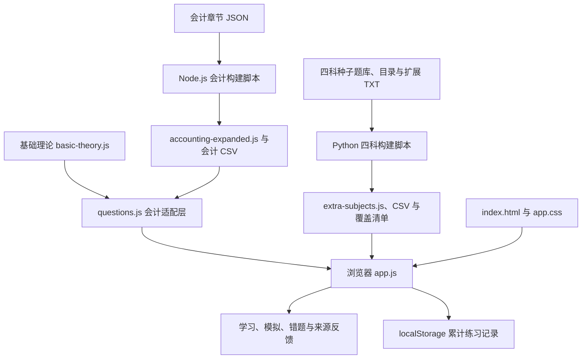

# CPA 刷题库（2026 教材版）

面向注册会计师备考的静态网页练习工具，按 2026 年教材的科目、学习模块、章节与知识节组织原创练习题，提供章节学习、机考短练、错题复习和教材来源回查。

本仓库保存网页版、Windows 离线版及其构建和题库维护工具。当前开放会计、经济法、财务成本管理、税法和审计五科；公司战略与风险管理及综合阶段两套试卷的入口仍为待补充状态。项目不是中注协官方练习网站，也不提供官方真题保证。

## 功能

- **章节学习**：按模块、章、知识节选题；会计默认进入当前章的首个知识节，其他四科默认显示本章全部题目。
- **判分与解析**：单选、多选按答案精确匹配自动判分；简答、辨析和计算题展示参考答案后由学习者自评。反馈包含知识点、解析及来源位置。
- **机考短练**：计时 45 分钟，最多抽取 10 道单选、5 道多选和 5 道简答，交卷后查看解析。题型数量不足时不会补齐；当前会计题库全为单选，因此会计模拟实际为 10 题。该模式不代表正式考试的题型比例、时长或难度。
- **错题复习**：记录判分后的累计练习次数、正确次数和错题状态；一道错题连续答对 3 次后移出错题集。
- **退出后继续**：自动保存各科当前练习的模式、章节、知识节、题号、答案、简答草稿、选项顺序及模拟剩余时间；刷新或重新打开后恢复上次作答，关闭期间暂停模拟计时。已提交题目保留解析和计分状态，恢复后不会重复累计练习次数。
- **辅助操作**：标记题目、打乱选项、调整字号、计算器、键盘操作及适配手机屏幕的题目导航。
- **题库下载**：按科目下载 CSV；另提供四科模块与知识点清单、知识点与题号对应表，以及会计教材位置覆盖表。

## 当前题库规模

以下数字来自当前仓库的实际运行时题库与覆盖文件，更新题库后应同步核对。

| 科目 | 题目数 | 章节数 | 知识节数 |
| --- | ---: | ---: | ---: |
| 会计 | 2,331 | 30 | 127 |
| 经济法 | 305 | 12 | 65 |
| 财务成本管理 | 393 | 20 | 81 |
| 税法 | 309 | 14 | 74 |
| 审计 | 394 | 24 | 120 |
| **合计** | **3,732** | **100** | **467** |

会计由第 1—3 章基础理论 280 题和第 4—30 章扩展题 2,051 题组成；扩展部分覆盖 27 章、112 个知识节。其他四科合计 1,401 题，覆盖 70 章、340 个知识节。

“覆盖”表示相应知识节已有练习题，不能据此推断已穷尽每条细则、例外、例题或跨章综合考法。应结合覆盖清单和教材核对具体知识点。

## 系统架构

项目采用 **静态 HTML + CSS + 原生 JavaScript ES modules**。题库由 Node.js / Python 脚本提前生成，浏览器加载静态资源后在本机完成选题、答题与判分；无需数据库、登录服务或应用后端，也没有 npm/pip 第三方依赖。



主要职责：

| 层次 | 文件 | 职责 |
| --- | --- | --- |
| 页面与样式 | `dist/index.html`、`dist/app.css` | 科目入口、练习界面、弹窗和响应式布局 |
| 交互与状态 | `dist/app.js` | 科目切换、会话管理、抽题、判分、计时、错题、标记及浏览器存储 |
| 进度保存与恢复 | `dist/progress.js` | 以题号保存各科会话，校验并恢复答案、题号、选项顺序和剩余时间 |
| 会计运行时题库 | `dist/questions.js`、`dist/basic-theory.js`、`dist/accounting-expanded.js` | 合并基础与扩展题，并统一章节、题号、答案索引和知识点字段 |
| 四科运行时题库 | `dist/extra-subjects.js` | 提供四科的题目、目录、学习模块和覆盖信息 |
| 内容维护 | `content/` | 保存可编辑题库源数据、教材目录、生成和校验工具 |
| 静态托管配置 | `.openai/hosting.json` | 指定发布目录为 `dist` |

页面入口只加载 `app.js`，其静态导入会计和四科题库，因此首次加载会同时下载各科题库资源。

支持 WebMCP 的浏览器还可通过 `document.modelContext.registerTool` 注册页面状态读取与会计题目导航工具；该能力是可选的，不是服务端学习数据接口，普通浏览器不需要配置。

## 数据保存与隐私

浏览器存储键为 `cpa-accounting-zero-v1`，保存以下内容：

- `records`：按题号记录 `attempts`、`correct`、`wrong`、`streak`。
- `marks`：已标记的题号。
- `shuffle`：是否打乱选项。

另使用 `cpa-practice-sessions-v1` 保存各科最近一次练习的题号列表、当前位置、答案和简答草稿、提交与自评状态、选项顺序、模拟剩余时间，以及最后打开的科目、选科页状态和字号。题库正文不重复写入浏览器存储。

每次选择答案、输入草稿、翻题、提交及模拟计时都会保存；刷新或关闭后重新打开可继续作答。返回选科页、切换科目和关闭页面时暂停对应模拟练习，重新进入时继续剩余时间。已交卷的结果和已查看的解析也会保留。点击练习模式、重新抽题或切换章节/知识节会开始新的练习并替换该科的当前会话。

旧版的累计记录、错题和标记继续保留；旧版没有保存的未完成作答无法补回。保存损坏、题库中已移除题号或存储不可用时会安全回到新练习，累计统计仍使用原存储键。页面会提示当前进度能否保存。

记录不上传服务器，也不自动跨设备同步。同一网址的不同协议、域名或端口，以及不同浏览器/用户配置，会分别保存记录。清除站点数据会删除本地记录；存储不可用时仍可练习，但不能保证持久保存。当前网页版未提供学习记录导入导出或逐场练习历史。

## 目录结构

```text
.
├─ README.md
├─ .openai/hosting.json
├─ content/
│  ├─ README.md                  # 题库维护说明
│  ├─ seed-bank.json             # 四科原有 280 题
│  ├─ catalog.py                 # 学习模块与章节映射
│  ├─ build_bank.py              # 四科构建与内置校验
│  ├─ expansion/
│  │  ├─ sections.py             # 四科教材知识节目录
│  │  └─ audit.txt / finance.txt / law.txt / tax.txt
│  └─ accounting/
│     ├─ chapter4.json … chapter30.json
│     ├─ build.mjs               # 会计扩展题构建
│     └─ verify.mjs              # 会计题库与 CSV 校验
└─ dist/
   ├─ index.html / app.css / app.js
   ├─ questions.js / basic-theory.js / accounting-expanded.js
   ├─ extra-subjects.js
   ├─ *-questions.csv / questions.csv
   ├─ accounting-coverage.csv
   ├─ coverage.json / knowledge-points.csv
   └─ study-guide.md
```

注意：`dist` 同时包含手工维护的网页源码与生成的题库资源，不能作为普通构建缓存整体删除。基础理论题目前直接维护在 `dist/basic-theory.js`，没有对应的独立 JSON 源文件。

## Windows 离线版下载与构建

[下载 CPA会计从零刷题_离线版_Windows.exe](downloads/windows/CPA会计从零刷题_离线版_Windows.exe)

Windows 离线版由当前 `dist` 源代码构建，内嵌五科共 3,732 题和下载文件，通过默认浏览器打开，不需要启动 HTTP 服务。启动器使用 .NET Framework 4，保留旧版的固定临时网页路径和浏览器统计存储键；使用相同浏览器配置时可以保留原记录。网页版和 EXE 的答题进度按各自浏览器来源分别保存。

当前 EXE 的 SHA-256：`7AEE913F12DDFF0DC96FAC9052C16A14F1584FFE62D4B25CDD86299A5FB6282F`。

构建需要 Windows、Node.js 和系统的 .NET Framework C# 编译器。在仓库根目录执行：

```powershell
.\windows\build.ps1 -NodePath node
```

输出到 `downloads/windows/`。`windows/build-offline.mjs` 将网页模块、样式和下载文件合并并压缩，`windows/Launcher.cs` 将内嵌网页写到旧版固定路径，再用默认浏览器打开。中间产物位于已忽略的 `work/windows-build/`。EXE 支持 `--extract <路径>`，可验证内嵌网页而不打开浏览器。

进度恢复测试：

```powershell
node --test tests/progress.test.mjs tests/app-resume.test.mjs
```

先运行 Windows 构建生成内嵌网页，再执行以上测试；测试覆盖网页应用重新初始化、未提交草稿、多科会话、同一模拟试卷与选项顺序、剩余时间、已交卷结果、避免重复计分、损坏存储及实际 EXE 网页载入。

## 本地运行

浏览器运行只需要静态 HTTP 服务。下面以 Python 为例；题库已提交在 `dist` 中，查看现有网站无需先构建。

```powershell
git clone https://github.com/hHeyLgMK/hHeyLgMK-cpa-accounting-from-zero-2026.git
cd hHeyLgMK-cpa-accounting-from-zero-2026
python -m http.server 8000 --bind 127.0.0.1 --directory dist
```

打开 <http://127.0.0.1:8000/>。私有仓库克隆前需先完成 GitHub 授权；Linux/macOS 可按本机环境将 `python` 替换为 `python3`。

页面使用 ES modules，请通过 HTTP 服务访问；直接双击 `index.html` 的 `file://` 方式可能被浏览器的模块加载策略阻止。

## 题库构建与验证

题库维护脚本使用 Python 3 和 Node.js。以下命令已在 Python 3.12.14、Node.js 24.19.0（Node.js 24 LTS）上核对，其他版本的兼容性需自行验证。不需要运行 `npm install` 或 `pip install`。

以下构建命令在仓库根目录执行，会重写对应的生成资源：

```powershell
# 构建经济法、财管、税法、审计题库
python -X utf8 content/build_bank.py

# 构建会计第 4—30 章，并更新完整会计 CSV
node content/accounting/build.mjs
```

四科脚本以 `seed-bank.json`、`catalog.py`、`expansion/sections.py` 和四个扩展 TXT 为输入，生成 `extra-subjects.js`、各科 CSV、`coverage.json`、`knowledge-points.csv` 和 `study-guide.md`。`coverage.json` 只描述这四科，不含会计。

会计脚本读取第 4—30 章 JSON，并结合基础理论题生成 `accounting-expanded.js`、`questions.csv` 和 `accounting-coverage.csv`。正式构建不要添加 `--allow-partial`；该参数仅用于允许缺少整章的临时维护场景。

会计只读验证需要从 `content/accounting` 目录运行，因为脚本内 CSV 路径按当前工作目录解析：

```powershell
Push-Location content/accounting
try {
    node verify.mjs
} finally {
    Pop-Location
}
```

当前验证检查 2,331 个会计题号与题干唯一、2,051 道扩展题、教材/PDF 页码关系及 CSV 行数。新增题目后应同步更新 `verify.mjs` 中的题量基准。四科校验内置于 `build_bank.py`，仓库未提供独立的 `npm test` 或四科验证命令。

## 内容维护规范

1. **保持题号稳定**：浏览器练习记录以题号为键。不要复用旧题号或通过排序调整改变已有题的含义。
2. **四科扩展题**：在对应 `content/expansion/*.txt` 中用 `@章.节` 分组，题行格式为 `知识点|题目|参考答案|解析`。四个字段中不支持竖线转义；新题追加到所属节末尾，不要插入到原有题之前。
3. **目录调整**：同步维护 `catalog.py` 与 `expansion/sections.py`，并重新生成覆盖清单。
4. **会计扩展题**：编辑相应章节 JSON。当前题型为单选，每题须有四个不同选项、有效答案、知识点、解析和教材位置；构建工具校验重复题号/题干、章内页码范围等条件，并轮转正确答案位置。
5. **网页修改**：直接编辑 `dist/index.html`、`app.css`、`app.js`；修改基础理论题时编辑 `dist/basic-theory.js`。
6. **提交前检查**：运行对应构建/验证，检查生成文件差异，并在浏览器中核对科目入口、章节筛选、判分、来源链接和下载入口。源码及其生成资源应一起提交。

更详细的题库说明见 [content/README.md](content/README.md)，具体覆盖见 [四科知识点清单](dist/study-guide.md) 和 [会计覆盖 CSV](dist/accounting-coverage.csv)。

## 部署

将整个 `dist/` 目录作为静态站点发布根目录，保持其内部相对路径。可部署到支持静态文件的 Web 服务、GitHub Pages 或其他静态托管平台；`.openai/hosting.json` 的站点目录也配置为 `dist`。

若部署到仓库子路径（例如 `/仓库名/`），应从该子路径打开 `index.html` 并保留全部 JS、CSS 和下载文件。当前仓库没有服务端构建流程或自动部署工作流；推送 GitHub 本身不等于已经启用网站托管。

## 已知限制与来源说明

- 当前只开放五科，不是专业阶段六科和综合阶段的完整题库；本仓库未包含 Android APK 及其原生壳源码，Windows 启动器源码和预编译 EXE 已提供。
- 机考短练的抽题数量取决于各科实际题型；页面中的固定“20 题”说明与会计当前实际 10 题存在差异，以实际抽题结果为准。
- 题库是原创学习练习，不等同于官方真题；简答自评与客观题判分不能代表正式考试评分。
- 四科新增题的教材/PDF 标注是所属知识节的阅读范围，未声称逐题精确页码。会计扩展题保留印刷页及 PDF 页定位。
- 税法资料存在印刷页 628—629 的扫描缺失，第 630 页起 PDF 偏移由 +9 改为 +7；三道相关信用管理题单独引用官方补充文件，详情见覆盖清单。
- 内容按仓库中现有 2026 年教材资料编排。税法、经济法等内容更新时需要人工复核题目、答案和来源；“目录有题”不代表知识点或规则永久完整。

## 授权与贡献

仓库当前没有 `LICENSE` 文件，尚未声明代码及题库的开源许可证。教材名称、页码和官方链接用于回查来源，教材 PDF 不随仓库分发。

反馈问题时请提供科目、题号、预期答案、实际表现及相关教材位置；修改题目时保留来源和题号稳定性，并附上验证结果。
